# usp_BuildCustomerCommsProfile Process Analysis Report

## 1. Business Purpose
This process builds a comprehensive profile for a customer that includes basic details, mailing address availability, last interaction date, communication preferences, marketing engagement, and customer segmentation.

## 2. Key Business Process

```mermaid
flowchart TD
    classDef default fill:#fff,stroke:#000,color:#000
    classDef funcBox fill:#000,stroke:#fff,color:#fff
    classDef stepBox fill:#fff,stroke:#000,color:#000
    classDef decisionBox fill:#ffffcc,stroke:#000,color:#000
    classDef terminalBox fill:#ffcccc,stroke:#000,color:#000
    classDef subgraphStyle fill:#f5f6fbff,stroke:#000,stroke-width:1px
    step0[Step 1- Fetches core customer details from the Customers table, optionally filtered by CustomerID.]
    class step0 stepBox
    step1[Step 2- Determines if the customer has a valid mailing address by inspecting related address records.]
    class step1 stepBox
    step2[Step 3- Consolidates activity from LoanApplications, Loans, and LoanPayments to determine the most recent interaction date.]
    class step2 stepBox
    step3[Step 4- Fetches explicit opt-in statuses for Email and Postal channels from communication preferences.]
    class step3 stepBox
    step4[Step 5- Evaluates if the customer has recently opened a marketing email based on the defined lookback period.]
    class step4 stepBox
    step5[Step 6- Checks if the customer holds any active loans by evaluating loan records.]
    class step5 stepBox
    step6[Step 7- Computes the number of days elapsed since the customers most recent interaction using the current date Today and LastInteractionDate.]
    class step6 stepBox
    step7[Step 8- Assigns a customer segment based on active loan status and recency of last interaction. Segments include Active Loan Holder, Recent Inactive, Long-term Inactive, and Prospect New.]
    class step7 stepBox
    step0 --> step1
    step1 --> step2
    step2 --> step3
    step3 --> step4
    step4 --> step5
    step5 --> step6
    step6 --> step7
    step7_end[[Returns the complete customer communications profile with segmentation]]
    class step7_end terminalBox
    step7 --> step7_end
```


### Process Steps

| Step Details | Business Function Name | Business Function Description |
|--------------|------------------------|-------------------------------|
| **STEP-001**<br><small>Type: data-retrieval<br>Function: BF-001</small> | Retrieve Base Customer Information | Extracts basic customer details from the Customers table by optionally filtering on CustomerID. |
| **STEP-002**<br><small>Type: data-retrieval<br>Function: BF-002</small> | Evaluate Mailing Address Presence | Determines if a customer has a valid mailing address based on address type and completeness of address fields. |
| **STEP-003**<br><small>Type: calculation<br>Function: BF-003</small> | Aggregate Last Interaction Date | Consolidates different sources of customer activity to obtain the most recent interaction date for each customer. |
| **STEP-004**<br><small>Type: data-retrieval<br>Function: BF-004</small> | Fetch Communication Preferences | Retrieves customer communication preferences and calculates explicit opt-in statuses for both Email and Postal channels. |
| **STEP-005**<br><small>Type: data-retrieval<br>Function: BF-005</small> | Assess Recent Marketing Opens | Evaluates marketing email campaigns to identify if the customer has engaged by opening an email within the defined lookback period. |
| **STEP-006**<br><small>Type: data-retrieval<br>Function: BF-006</small> | Determine Active Loan Status | Checks if the customer currently holds an active loan by evaluating the status from the Loans table. |
| **STEP-007**<br><small>Type: calculation<br>Function: BF-003</small> | Aggregate Last Interaction Date | Consolidates different sources of customer activity to obtain the most recent interaction date for each customer. |
| **STEP-008**<br><small>Type: calculation<br>Function: BF-007</small> | Compute Customer Segmentation | Determines the final customer segment label based on active status and recency of interaction. |


## 3. Testable Units Overview
### TU-001: Retrieve Base Customer Information

**Category:** data retrieval

**Business Function:** BF-001

**Description:** Extracts basic customer details from the Customers table by optionally filtering on CustomerID.

**SQL Implementation:**

```sql
WITH BaseCustomers AS (
    SELECT
        c.CustomerID,
        c.FirstName,
        c.LastName,
        c.Email AS PrimaryEmail
    FROM dbo.Customers c
    WHERE (@CustomerID IS NULL OR c.CustomerID = @CustomerID)
)
```

**Test Scenarios:**

| ID / Type | Description | Considerations |
|-----------|------------|---------------|
| **TS-001**<br><small>normal</small> | When normal conditions exist, retrieve base customer information should function correctly | Verify normal operation and expected outputs |
| **TS-002**<br><small>error</small> | When error conditions exist, retrieve base customer information should handle gracefully | Test error handling and recovery mechanisms |

---

### TU-002: Evaluate Mailing Address Presence

**Category:** data transformation

**Business Function:** BF-002

**Description:** Determines if a customer has a valid mailing address based on address type and completeness of address fields.

**SQL Implementation:**

```sql
WITH PrimaryAddresses AS (
    SELECT
        a.CustomerID,
        MAX(CASE WHEN a.AddressType IN ('Billing', 'Shipping')
                 AND a.StreetAddress IS NOT NULL AND a.City IS NOT NULL
                 AND a.PostalCode IS NOT NULL AND a.Country IS NOT NULL
                 THEN 1 ELSE 0 END) AS HasMailingAddress
    FROM dbo.Addresses a
    WHERE (@CustomerID IS NULL OR a.CustomerID = @CustomerID)
    GROUP BY a.CustomerID
)
```

**Test Scenarios:**

| ID / Type | Description | Considerations |
|-----------|------------|---------------|
| **TS-001**<br><small>normal</small> | When normal conditions exist, evaluate mailing address presence should function correctly | Verify normal operation and expected outputs |
| **TS-002**<br><small>error</small> | When error conditions exist, evaluate mailing address presence should handle gracefully | Test error handling and recovery mechanisms |

---

### TU-003: Aggregate Last Interaction Date

**Category:** calculation

**Business Function:** BF-003

**Description:** Consolidates different sources of customer activity to obtain the most recent interaction date for each customer.

**SQL Implementation:**

```sql
WITH LastActivityDates AS (
    SELECT
        CustomerID,
        MAX(ActivityDate) AS LastInteractionDate
    FROM (
        SELECT CustomerID, MAX(ApplicationDate) AS ActivityDate FROM dbo.LoanApplications WHERE (@CustomerID IS NULL OR CustomerID = @CustomerID) GROUP BY CustomerID
        UNION ALL
        SELECT CustomerID, MAX(StartDate) AS ActivityDate FROM dbo.Loans WHERE Status = 'Active' AND (@CustomerID IS NULL OR CustomerID = @CustomerID) GROUP BY CustomerID
        UNION ALL
        SELECT l.CustomerID, MAX(lp.PaymentDate) AS ActivityDate FROM dbo.LoanPayments lp JOIN dbo.Loans l ON lp.LoanID = l.LoanID WHERE (@CustomerID IS NULL OR l.CustomerID = @CustomerID) GROUP BY l.CustomerID
    ) AS ActivitySources
    GROUP BY CustomerID
)
```

**Test Scenarios:**

| ID / Type | Description | Considerations |
|-----------|------------|---------------|
| **TS-001**<br><small>normal</small> | When valid inputs are provided, aggregate last interaction date should calculate correct results | Verify mathematical accuracy and proper data types |
| **TS-002**<br><small>edge</small> | When edge case values are provided, aggregate last interaction date should handle appropriately | Test with boundary values, zero, negative numbers |
| **TS-003**<br><small>null</small> | When NULL values are encountered, aggregate last interaction date should handle gracefully | Verify NULL handling in calculations |

---

### TU-004: Fetch Communication Preferences

**Category:** data transformation

**Business Function:** BF-004

**Description:** Retrieves customer communication preferences and calculates explicit opt-in statuses for both Email and Postal channels.

**SQL Implementation:**

```sql
WITH CommunicationPrefs AS (
    SELECT
        cp.CustomerID,
        MAX(CASE WHEN cp.Channel = 'Email' AND cp.OptInStatus = 1 THEN 1 ELSE 0 END) AS EmailOptInExplicit,
        MAX(CASE WHEN cp.Channel = 'Post' AND cp.OptInStatus = 1 THEN 1 ELSE 0 END) AS PostalOptInExplicit
    FROM dbo.CommunicationPreferences cp
    WHERE (@CustomerID IS NULL OR cp.CustomerID = @CustomerID)
    GROUP BY cp.CustomerID
)
```

**Test Scenarios:**

| ID / Type | Description | Considerations |
|-----------|------------|---------------|
| **TS-001**<br><small>normal</small> | When normal conditions exist, fetch communication preferences should function correctly | Verify normal operation and expected outputs |
| **TS-002**<br><small>error</small> | When error conditions exist, fetch communication preferences should handle gracefully | Test error handling and recovery mechanisms |

---

### TU-005: Assess Recent Marketing Opens

**Category:** data retrieval

**Business Function:** BF-005

**Description:** Evaluates marketing email campaigns to identify if the customer has engaged by opening an email within the defined lookback period.

**SQL Implementation:**

```sql
WITH RecentMarketingOpens AS (
    SELECT
        mes.CustomerID,
        MAX(CAST(mes.WasOpened AS INT)) AS OpenedMarketingEmailRecently
    FROM dbo.MarketingEmailsSent mes
    WHERE mes.SentDate >= DATEADD(day, -@MarketingOpenLookbackDays, @Today)
      AND (@CustomerID IS NULL OR mes.CustomerID = @CustomerID)
    GROUP BY mes.CustomerID
)
```

**Test Scenarios:**

| ID / Type | Description | Considerations |
|-----------|------------|---------------|
| **TS-001**<br><small>normal</small> | When normal conditions exist, assess recent marketing opens should function correctly | Verify normal operation and expected outputs |
| **TS-002**<br><small>error</small> | When error conditions exist, assess recent marketing opens should handle gracefully | Test error handling and recovery mechanisms |

---

### TU-006: Determine Active Loan Status

**Category:** validation

**Business Function:** BF-006

**Description:** Checks if the customer currently holds an active loan by evaluating the status from the Loans table.

**SQL Implementation:**

```sql
WITH ActiveStatus AS (
    SELECT
        l.CustomerID,
        MAX(CASE WHEN l.Status = 'Active' THEN 1 ELSE 0 END) AS IsActiveCustomer
    FROM dbo.Loans l
    WHERE (@CustomerID IS NULL OR l.CustomerID = @CustomerID)
    GROUP BY l.CustomerID
)
```

**Test Scenarios:**

| ID / Type | Description | Considerations |
|-----------|------------|---------------|
| **TS-001**<br><small>normal</small> | When validation conditions are met, determine active loan status should pass validation | Verify all validation criteria are properly evaluated |
| **TS-002**<br><small>error</small> | When validation conditions are not met, determine active loan status should fail validation | Ensure proper error handling and validation failure detection |
| **TS-003**<br><small>null</small> | When input values are NULL, determine active loan status should handle gracefully | Test behavior with NULL inputs and edge cases |

---

### TU-007: Compute Customer Segmentation

**Category:** calculation

**Business Function:** BF-007

**Description:** Determines the final customer segment label based on active status and recency of interaction.

**SQL Implementation:**

```sql
CASE
    WHEN ISNULL(act.IsActiveCustomer, 0) = 1 THEN 'Active Loan Holder'
    WHEN lad.LastInteractionDate >= DATEADD(year, -1, @Today) THEN 'Recent Inactive'
    WHEN lad.LastInteractionDate < DATEADD(year, -1, @Today) THEN 'Long-term Inactive'
    ELSE 'Prospect/New'
END AS CustomerSegment
```

**Test Scenarios:**

| ID / Type | Description | Considerations |
|-----------|------------|---------------|
| **TS-001**<br><small>normal</small> | When valid inputs are provided, compute customer segmentation should calculate correct results | Verify mathematical accuracy and proper data types |
| **TS-002**<br><small>edge</small> | When edge case values are provided, compute customer segmentation should handle appropriately | Test with boundary values, zero, negative numbers |
| **TS-003**<br><small>null</small> | When NULL values are encountered, compute customer segmentation should handle gracefully | Verify NULL handling in calculations |

---

### TU-008: Marketing Open Lookback Configuration

**Category:** configuration

**Business Function:** BF-008

**Description:** Defines the lookback period (in days) that determines which marketing email opens are considered recent.

**SQL Implementation:**

```sql
No SQL implementation provided
```

**Test Scenarios:**

| ID / Type | Description | Considerations |
|-----------|------------|---------------|
| **TS-001**<br><small>normal</small> | When normal conditions exist, marketing open lookback configuration should function correctly | Verify normal operation and expected outputs |
| **TS-002**<br><small>error</small> | When error conditions exist, marketing open lookback configuration should handle gracefully | Test error handling and recovery mechanisms |

---


## 4. Stored Procedure Source Code
```sql
CREATE PROCEDURE usp_BuildCustomerCommsProfile (
    @CustomerID INT = NULL
)
AS
BEGIN
    SET NOCOUNT ON;

    DECLARE @Today DATE = CONVERT(DATE, GETDATE());
    DECLARE @MarketingOpenLookbackDays INT = 90;
    WITH BaseCustomers AS (
        SELECT
            c.CustomerID,
            c.FirstName,
            c.LastName,
            c.Email AS PrimaryEmail
        FROM dbo.Customers c
        WHERE (@CustomerID IS NULL OR c.CustomerID = @CustomerID)
    ),


    PrimaryAddresses AS (
        SELECT
            a.CustomerID,
            MAX(CASE WHEN a.AddressType IN ('Billing', 'Shipping')
                     AND a.StreetAddress IS NOT NULL AND a.City IS NOT NULL
                     AND a.PostalCode IS NOT NULL AND a.Country IS NOT NULL
                     THEN 1 ELSE 0 END) AS HasMailingAddress
        FROM dbo.Addresses a
        WHERE (@CustomerID IS NULL OR a.CustomerID = @CustomerID)
        GROUP BY a.CustomerID
    ),


    LastActivityDates AS (
        SELECT
            CustomerID,
            MAX(ActivityDate) AS LastInteractionDate
        FROM (

            SELECT CustomerID, MAX(ApplicationDate) AS ActivityDate FROM dbo.LoanApplications WHERE (@CustomerID IS NULL OR CustomerID = @CustomerID) GROUP BY CustomerID
            UNION ALL

            SELECT CustomerID, MAX(StartDate) AS ActivityDate FROM dbo.Loans WHERE Status = 'Active' AND (@CustomerID IS NULL OR CustomerID = @CustomerID) GROUP BY CustomerID
            UNION ALL

            SELECT l.CustomerID, MAX(lp.PaymentDate) AS ActivityDate FROM dbo.LoanPayments lp JOIN dbo.Loans l ON lp.LoanID = l.LoanID WHERE (@CustomerID IS NULL OR l.CustomerID = @CustomerID) GROUP BY l.CustomerID

        ) AS ActivitySources
        GROUP BY CustomerID
    ),


    CommunicationPrefs AS (
        SELECT
            cp.CustomerID,
            MAX(CASE WHEN cp.Channel = 'Email' AND cp.OptInStatus = 1 THEN 1 ELSE 0 END) AS EmailOptInExplicit,
            MAX(CASE WHEN cp.Channel = 'Post' AND cp.OptInStatus = 1 THEN 1 ELSE 0 END) AS PostalOptInExplicit
        FROM dbo.CommunicationPreferences cp
        WHERE (@CustomerID IS NULL OR cp.CustomerID = @CustomerID)
        GROUP BY cp.CustomerID
    ),


    RecentMarketingOpens AS (
        SELECT
            mes.CustomerID,
            MAX(CAST(mes.WasOpened AS INT)) AS OpenedMarketingEmailRecently
        FROM dbo.MarketingEmailsSent mes
        WHERE mes.SentDate >= DATEADD(day, -@MarketingOpenLookbackDays, @Today)
          AND (@CustomerID IS NULL OR mes.CustomerID = @CustomerID)
        GROUP BY mes.CustomerID
    ),


    ActiveStatus AS (
        SELECT
            l.CustomerID,
            MAX(CASE WHEN l.Status = 'Active' THEN 1 ELSE 0 END) AS IsActiveCustomer
        FROM dbo.Loans l
        WHERE (@CustomerID IS NULL OR l.CustomerID = @CustomerID)
        GROUP BY l.CustomerID
    )


    SELECT
        bc.CustomerID,
        bc.FirstName,
        bc.LastName,
        bc.PrimaryEmail,
        ISNULL(pa.HasMailingAddress, 0) AS HasMailingAddress,


        ISNULL(cp.EmailOptInExplicit, 0) AS EmailOptInStatus,
        ISNULL(cp.PostalOptInExplicit, 0) AS PostalOptInStatus,

        lad.LastInteractionDate,

        CASE
            WHEN lad.LastInteractionDate IS NOT NULL THEN DATEDIFF(day, lad.LastInteractionDate, @Today)
            ELSE NULL
        END AS DaysSinceLastInteraction,

        ISNULL(act.IsActiveCustomer, 0) AS IsActiveCustomer,
        ISNULL(rmo.OpenedMarketingEmailRecently, 0) AS OpenedMarketingEmailRecently,


        CASE
            WHEN ISNULL(act.IsActiveCustomer, 0) = 1 THEN 'Active Loan Holder'
            WHEN lad.LastInteractionDate >= DATEADD(year, -1, @Today) THEN 'Recent Inactive'
            WHEN lad.LastInteractionDate < DATEADD(year, -1, @Today) THEN 'Long-term Inactive'
            ELSE 'Prospect/New'
        END AS CustomerSegment

    FROM BaseCustomers bc
    LEFT JOIN PrimaryAddresses pa ON bc.CustomerID = pa.CustomerID
    LEFT JOIN LastActivityDates lad ON bc.CustomerID = lad.CustomerID
    LEFT JOIN CommunicationPrefs cp ON bc.CustomerID = cp.CustomerID
    LEFT JOIN RecentMarketingOpens rmo ON bc.CustomerID = rmo.CustomerID
    LEFT JOIN ActiveStatus act ON bc.CustomerID = act.CustomerID
    ORDER BY bc.LastName, bc.FirstName;

END;
```
